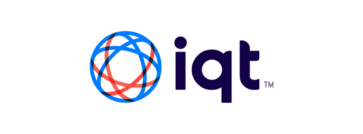

[contributors-shield]: https://img.shields.io/github/contributors/IQTLabs/edgetech-template.svg?style=for-the-badge
[contributors-url]: https://github.com/IQTLabs/edgetech-template/graphs/contributors
[forks-shield]: https://img.shields.io/github/forks/IQTLabs/edgetech-template.svg?style=for-the-badge
[forks-url]: https://github.com/IQTLabs/edgetech-template/network/members
[stars-shield]: https://img.shields.io/github/stars/IQTLabs/edgetech-template.svg?style=for-the-badge
[stars-url]: https://github.com/IQTLabs/edgetech-template/stargazers
[issues-shield]: https://img.shields.io/github/issues/IQTLabs/edgetech-template.svg?style=for-the-badge
[issues-url]: https://github.com/IQTLabs/edgetech-template/issues
[license-shield]: https://img.shields.io/github/license/IQTLabs/edgetech-template.svg?style=for-the-badge
[license-url]: https://github.com/IQTLabs/edgetech-template/blob/master/LICENSE.txt
[product-screenshot]: images/screenshot.png
[python]: https://img.shields.io/badge/python-000000?style=for-the-badge&logo=python
[python-url]: https://www.python.org
[poetry]: https://img.shields.io/badge/poetry-20232A?style=for-the-badge&logo=poetry
[poetry-url]: https://python-poetry.org
[docker]: https://img.shields.io/badge/docker-35495E?style=for-the-badge&logo=docker
[docker-url]: https://www.docker.com

[![Contributors][contributors-shield]][contributors-url]
[![Forks][forks-shield]][forks-url]
[![Stargazers][stars-shield]][stars-url]
[![Issues][issues-shield]][issues-url]
[![MIT License][license-shield]][license-url]

 

  

<h1 align="center">SkyScan C2</h1>

This repo is designed to be part of a SkyScan system. SkyScan automatically points a Pan Tilt Zoom (PTZ) camera at an aircraft based on the location information broadcast in an ADS-B message. SkyScan C2 ingests a ledger of potential aircraft and selects one to point the camera at. It is run as a Docker container and messages are passed to it using MQTT. 

### Configuration
SkyScan C2 makes it selection based on the distance of aircraft from the camera location. Based on where the camera is located and weather conditions, it may not be able to see all of the surrounding aircraft. You can have SkyScan C2 ignore these obscured aircraft by configuring the following environment variables:
- **MIN_TILT**: The minimum tilt angle above the horizon for the camera. This is useful for when trees or buildings might obscure the horizon
- **MIN_ALTITUDE**: The minimum altitude of an aircraft. This is useful when there are nearby aircraft that are on the ground and should be ignored.
- **MAX_ALTITUDE**: The maximum altitude of an aircraft. This is useful when there are clouds and you want to ignore any aircrafts that are in the clouds.

## Usage

This module is designed to be used in concert with other modules to
build a complete tracking system. [SkyScan](https://github.com/IQTLabs/SkyScan), 
which tracks aircraft using ADS-B transmissions, is an example of the type of 
system that can be built.

 Checkout the `docker-compose.yml` in that repo to see how these modules
 can be connected together. The configuration for the system is stored in `.env` environment files. Examples of the different environment files
 are included in the **SkyScan** repo and can be configured them to match your setup.

### Built With

[![Python][python]][python-url]
[![Poetry][poetry]][poetry-url]
[![Docker][docker]][docker-url]

## License

Distributed under the [Apache 2.0](https://github.com/IQTLabs/edgetech-skyscan-c2/blob/main/LICENSE). See `LICENSE.txt` for more information.

## Contact IQTLabs

- Twitter: [@iqtlabs](https://twitter.com/iqtlabs)
- Email: info@iqtlabs.org

See our other projects: [https://github.com/IQTLabs/](https://github.com/IQTLabs/)

(<a href="#readme-top">back to top</a>)

